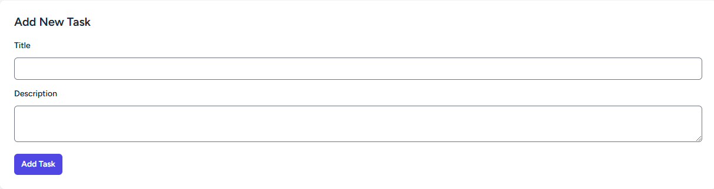
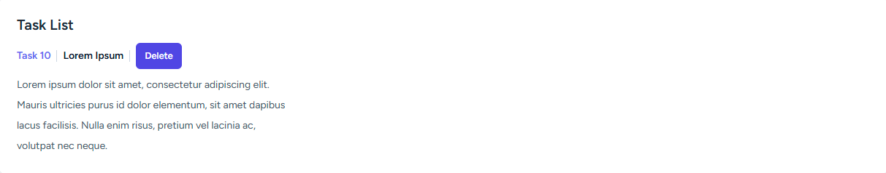

# Task Management System

A simple Task Management System built with Laravel for the backend and Vue.js for the frontend, utilizing Vite for hot-reloading and Inertia.js for smooth integration between the frontend and backend.

## Getting Started

### 1️. Clone the Repository
```bash
git clone https://github.com/your-username/task-management-with-vue-js.git
cd task-management-with-vue-js
```

### 2️. Install Dependencies
```bash
composer install
```

### 3️. Configure Environment Variables
```bash
cp .env.example .env
php artisan key:generate
```

Fill in the database information in the `.env` file:
```ini
DB_DATABASE=trapp
DB_USERNAME=root
DB_PASSWORD=secret
```

### 4️. Set Up the Database
```bash
php artisan migrate
```

### 5️. Install frontend dependencies
```bash
npm install
```

### 6. Start the Project
```bash
php artisan serve
npm run dev
```

You can now access the project at [http://localhost:8000](http://localhost:8000).
Vue.js frontend with Vite should be accessible at: http://localhost:5173

## Features
- Logs **create**, **update**, and **delete** operations on models.
- Stores data before and after changes.
- Simple and easy to integrate.

## Usage
- Create a Task: Navigate to the tasks page and create a new task by filling in the title and description.
- Edit a Task: Click on an existing task to edit its details.
- Delete a Task: Click the delete button to remove a task.
- Manage Task Status: Mark a task as Completed or Pending.

## Example Data
Here are some examples:



## API Endpoints
The following API endpoints are available for managing tasks:

- GET /api/tasks - List all tasks
- POST /api/tasks - Create a new task
- PUT /api/tasks/{id} - Update an existing task
- DELETE /api/tasks/{id} - Delete a task
